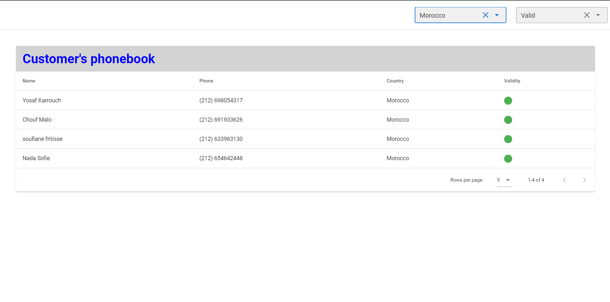

# Customer phone book project

This is  project created for a restful fullstack Web project. 
It Simulates a phonebook of some customers with their country and phone and wether this phone number is valid or no

## Technologies & Frameworks used for development

Front end: Vuejs.
Back-end: Spring Boot.

Additionally, Postman was used for endpoint testing.

## Version info

Front End
* Vuejs: v4.5.13
* Node: v10.15.0

Back End
* JDK: 1.8
* Spring boot: 2.5.5
* SQLite: 3.16.1
* JUnit: 4.13.2 (For unit tests)

## Task requirements

It was required to create a single-page web app that displays a a list of customers with their phone number and country and phone number validity.Phone number validity is checked against a rule (regex) for each country.

* Implement Filtering by phone number validity, country, or both.
* Implement Pagination (bonus requirement).
* Add unit test for services.
* Docorize the project

## Available data

* A SqlLite database file with one table 'customer' and 2 columns 'name' and 'phone number'.
* A rule for each country and country code to be used to check phone number validity.

## Challenges

* Database doesn't contain the validity of the phone number and thus this had to be checked after the database retrieval and this lead to the following decision:

** Devide the filtering to different cases to prevent retreiving all data in all cases. 

*** Country Filter : Database filter and pagination.
*** Validity Filter : Server-side filter and pagination after retreiving data.
*** Country and Validity filter: Database country filter , and server-side validity filter and pagination.

* Space complexity vs time Complexity: Deciding wether
** To store the rule for validity and country name and code in 2 maps (more Space) to retreive country code by a given country name in O(1).
** To store the rule for validity and country name and code in 1 map and retreive the name of a given country code in O(n).

I went for the second choice as this is only performed in case of filtring by country.

## Enhancements plan for existing code

* Store the hard-coded rules in a json file to make it open for extention close for modification (open-close principle) :

* Security and validation enhancement 

## Aditional frameworks used to enhance coding style and cleanliness

* Lombok (for getter & setter generation).

## Docorizing the app
** A docker-compose file and docker file are added to dockorize the app.

## How to run the project 

* Go to build folder (Contains the jar and db file).
* using bash run " docker-compose up ".
* open App on http://localhost:8080/

Run can also be done from inside the project by 

* Building the project to genetate the new jar. 'mvn clean package'
* Go to backend folder.
* using bash run " docker-compose up ".
* open App on http://localhost:8080/

## Unit tests

Controller unit tests

* Run CustomerControllerTests.java

Service unit tests

* Run CountryServiceTests.java
* Run CustomerServiceTests

## Screen Shots

* Find all

* Filtering by Country

* Filtering by Validity

* Filtering by both Country & Validity

